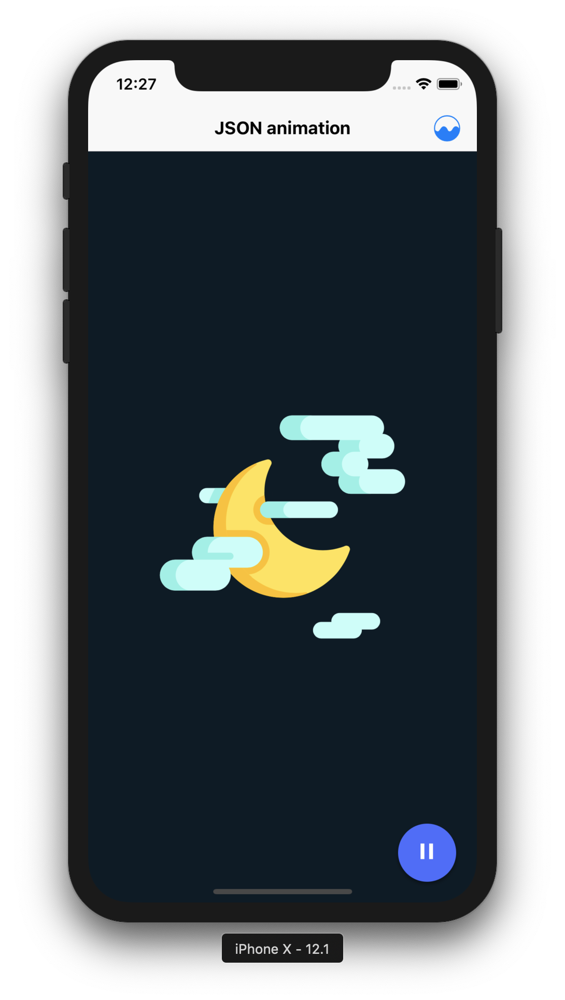

# React Native Animation!

 | 
:---: | :---: |

Hello there, this is a demo how you can create animations in React Native:

## JSON Animations
- Using [Lottie](https://airbnb.design/lottie/)
  * Check the community [here](https://www.lottiefiles.com)!

## Native Animations
- Using [Animated API](https://facebook.github.io/react-native/docs/animations) directly
- Using Components with [react-native-motion](https://github.com/xotahal/react-native-motion)!

## Supporting 🍻
I believe in Unicorns 🦄
Support [me](http://www.paypal.me/jdnichollsc/2), if you do too.

## Happy coding 💯
Made with ❤️

